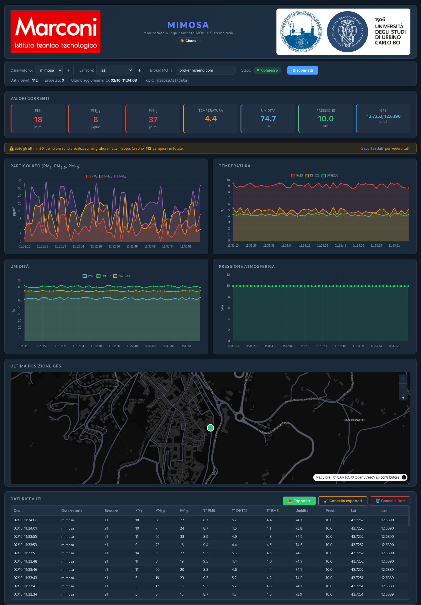

<div align="center">
  
  <br><br>
  <h1>MIMOSA</h1>
  <p><strong>Monitoraggio Inquinamento MObile Sistema Aria</strong></p>
  <p>
    Dashboard web per la qualità dell'aria in tempo reale<br>
    Riceve dati via MQTT da sensori MIMOSA su Raspberry Pi
  </p>
  <p>
    
    
    
    
    
  </p>
</div>

> **In una frase:** scarichi un file, lo apri, si apre una pagina web, premi **Connetti** e vedi i dati del sensore in tempo reale.

---

## Anteprima



> Video demo: [res/demo.mp4](res/demo.mp4) — panoramica della dashboard in azione con dati in tempo reale.

---

## 1. Cosa serve (requisiti)

- Un PC con **Windows, macOS o Linux**.
- Un **browser moderno** (Chrome, Edge, Firefox o Safari).
- Una **connessione a internet**: grafici, mappa e MQTT si caricano da internet.
  Senza internet la pagina si apre, ma grafici e mappa potrebbero non comparire.
- *(solo se compili dal codice sorgente)* **Go 1.26 o superiore**.

Non serve installare nulla: MIMOSA è un **singolo eseguibile** che contiene già
pagina web, stile, script e immagini.

---

## 2. Download e avvio in 3 passi

### Passo 1 — Scarica il file giusto

Dalla pagina [**Releases**](https://github.com/Paolo-Comper/mimosa-dashboard/releases):

| Il tuo computer                       | File da scaricare          |
| ------------------------------------- | -------------------------- |
| Windows (Intel/AMD, 64 bit)           | `mimosa-windows-amd64.exe` |
| Linux (Intel/AMD, 64 bit)             | `mimosa-linux-amd64`       |
| Mac con processore **Intel**          | `mimosa-darwin-amd64`      |
| Mac con processore **Apple (M1/M2/M3)** | `mimosa-darwin-arm64`    |

> Non sai quale Mac hai? Menu  → **Informazioni su questo Mac**: se vedi "Chip Apple" scarica `arm64`, se vedi "Intel" scarica `amd64`.

### Passo 2 — Avvialo

**Windows**
1. Rinomina il file scaricato in `mimosa.exe` (facoltativo ma comodo).
2. Doppio click.
3. Se appare l'avviso di Windows SmartScreen: **Ulteriori informazioni** → **Esegui comunque**.

**macOS**
1. Apri il Terminale nella cartella del file e digita:
   ```bash
   chmod +x mimosa-darwin-arm64      # oppure mimosa-darwin-amd64
   ./mimosa-darwin-arm64
   ```
2. Se macOS blocca l'app: tasto destro sul file → **Apri** → **Apri**, oppure:
   ```bash
   xattr -d com.apple.quarantine mimosa-darwin-arm64
   ```

**Linux**
```bash
chmod +x mimosa-linux-amd64
./mimosa-linux-amd64
```

### Passo 3 — Usa la dashboard

Il browser si apre da solo su **http://localhost:8080** (se non succede, aprirlo a mano).

1. **Osservatorio**: lascia `mimosa` (o premi **+** per aggiungerne uno).
2. **Sensore**: scegli il tuo sensore, oppure `Tutti i sensori`.
3. Premi **Connetti**.

I dati compaiono nella tabella, nei grafici e sulla mappa.

> Se non arriva nulla, controlla che il sensore pubblichi sul topic
> `{osservatorio}/{sensore}/data` (es. `mimosa/rpi-zero-1/data`).
> Per una prova immediata senza sensore vedi il [punto 4](#4-non-ho-un-sensore-dati-di-test).

Per fermare MIMOSA: torna al Terminale/finestra nera e premi **Ctrl + C**.

---

## 3. La schermata in breve

- **Valori correnti**: PM1, PM2.5, PM10, temperatura, umidità, pressione, GPS.
- **Grafici**: particolato, temperatura, umidità, pressione.
- **Mappa**: ultima posizione GPS ricevuta.
- **Tabella**: storico dei dati, filtrabile per osservatorio e sensore.
- **🌙 Notte / ☀️ Giorno**: cambia tema. Il tema **predefinito è quello chiaro** e la scelta viene ricordata.
- **📥 Esporta**: scegli CSV e/o JSON e scaricali anche insieme.
- **🧹 Cancella esportati**: elimina solo i dati già esportati.
- **🗑️ Cancella Dati**: svuota tutto lo storico.

I dati sono salvati nel browser (**localStorage**), quindi restano anche se ricarichi la pagina.

---

## 4. Non ho un sensore: dati di test

MIMOSA può pubblicare da sé dei dati di prova (simili a quelli di un sensore reale):

```bash
# Pubblica in continuo (ogni 2 secondi) finché non premi Ctrl+C
./mimosa --test --sensore rpi-zero-1

# Pubblica 50 messaggi e poi si ferma
./mimosa --test --sensore rpi-zero-2 --count 50

# Parametri completi
./mimosa --test --sensore rpi-zero-1 --osservatorio mimosa \
           --broker broker.hivemq.com --count 20
```

Mentre i messaggi vengono pubblicati, apri la dashboard e premi **Connetti**.

| Opzione          | Obbligatoria?              | Default                 |
| ---------------- | -------------------------- | ----------------------- |
| `--sensore`      | **Sì**, con `--test`       | —                       |
| `--osservatorio` | no                         | `mimosa`                |
| `--broker`       | no                         | `broker.hivemq.com`     |
| `--count`        | no                         | **infinito** (Ctrl+C)   |

Il topic pubblicato è `{osservatorio}/{sensore}/data`.

> Valgono ancora le vecchie sintassi `./mimosa --test rpi-zero-1 5`
> (sensore e numero di messaggi in posizione).

---

## 5. Comandi rapidi (cheat sheet)

| Comando                                                          | Cosa fa                                        |
| ---------------------------------------------------------------- | ---------------------------------------------- |
| `./mimosa`                                                       | Avvia la dashboard                             |
| `./mimosa --dev`                                                 | Avvia leggendo i file da disco (sviluppo)      |
| `./mimosa --help`                                                | Mostra l'aiuto                                 |
| `./mimosa --test --sensore NOME`                                 | Pubblica dati di test in continuo              |
| `./mimosa --test --sensore NOME --count 10`                      | Pubblica 10 messaggi di test                   |
| `PORT=9090 ./mimosa`                                             | Usa la porta 9090 invece di 8080               |

> Su Windows sostituisci `./mimosa` con `mimosa.exe` e `PORT=9090 ./mimosa` con
> `set PORT=9090 && mimosa.exe` (Prompt dei comandi) oppure `$env:PORT=9090; .\mimosa.exe` (PowerShell).

---

## 6. Formato dati MQTT

**Topic:** `{osservatorio}/{sensore}/data` — esempio `mimosa/rpi-zero-1/data`

```json
{
  "timestamp": 1771815991.22558,
  "pms":       { "pm1": 4, "pm25": 10, "pm10": 15, "temperature": 9.1, "humidity": 63.3 },
  "dht22":     { "temperature": 4.9, "humidity": 81.1 },
  "bme280":    { "temperature": 4.3, "humidity": 74.2, "pressure": 999.57 },
  "gps":       { "lat": 43.72386, "lon": 12.63765, "alt": 472.0, "sats": 7, "valid": true }
}
```

### Collegare un sensore reale (es. Raspberry Pi)

1. Il sensore pubblica su `{osservatorio}/{sensore}/data`
   (es. `mimosa/rpi-zero-1/data`).
2. Apri la dashboard, seleziona **Osservatorio** e **Sensore** e premi **Connetti**.
3. Usa il pulsante **+** accanto ai menu (o doppio click sul menu Sensore) per
   aggiungere osservatori/sensori personalizzati: restano memorizzati nel browser.

---

## 7. Esportazione dati

Il pulsante **📥 Esporta** apre un menu in cui scegli uno o più formati e premi
**⬇️ Scarica selezionati**. Se selezioni sia CSV che JSON, i file vengono
scaricati **insieme e sugli stessi dati** (stesso snapshot).

| Formato  | Uso tipico                  |
| -------- | --------------------------- |
| **CSV**  | Excel, LibreOffice, analisi |
| **JSON** | Elaborazioni programmatiche |

I record esportati vengono marcati come **esportati** (contatore "Esportati" e
spunta verde in tabella):

- **🧹 Cancella esportati** elimina solo i dati già esportati e lascia intatti
  quelli arrivati nel frattempo.
- **🗑️ Cancella Dati** svuota invece tutto lo storico.

---

## 8. Compilare dal codice sorgente

Serve **Go 1.26+**.

```bash
git clone https://github.com/Paolo-Comper/mimosa-dashboard.git
cd mimosa-dashboard
go build -o mimosa .
./mimosa
```

Per creare i file delle release per tutte le piattaforme:

```bash
mkdir -p dist
CGO_ENABLED=0 GOOS=linux   GOARCH=amd64 go build -trimpath -ldflags "-s -w" -o dist/mimosa-linux-amd64 .
CGO_ENABLED=0 GOOS=windows GOARCH=amd64 go build -trimpath -ldflags "-s -w" -o dist/mimosa-windows-amd64.exe .
CGO_ENABLED=0 GOOS=darwin  GOARCH=amd64 go build -trimpath -ldflags "-s -w" -o dist/mimosa-darwin-amd64 .
CGO_ENABLED=0 GOOS=darwin  GOARCH=arm64 go build -trimpath -ldflags "-s -w" -o dist/mimosa-darwin-arm64 .
```

---

## 9. Problemi comuni

| Problema | Soluzione |
| -------- | --------- |
| La pagina si apre ma **grafici e mappa non compaiono** | Serve internet: grafici, mappa e MQTT sono caricati da CDN online. |
| **Il browser non si apre da solo** | Vai a `http://localhost:8080` a mano. |
| **"Porta 8080 occupata"** | MIMOSA libera la porta da sola; se persiste usa un'altra porta: `PORT=9090 ./mimosa`. |
| **Non arrivano dati** | Controlla di aver premuto **Connetti** e che il topic sia `{osservatorio}/{sensore}/data`. |
| **Windows: il firewall chiede il permesso** | Accetta (serve per la porta locale). |
| **La mappa è grigia / non si carica** | Serve internet; attendi qualche secondo dal primo avvio. |
| **Dati vecchi con nomi strani** | I vecchi record vengono aggiornati automaticamente al primo avvio. Usa **🗑️ Cancella Dati** per ripartire pulito. |

---

## Licenza

[MIT](LICENSE)
